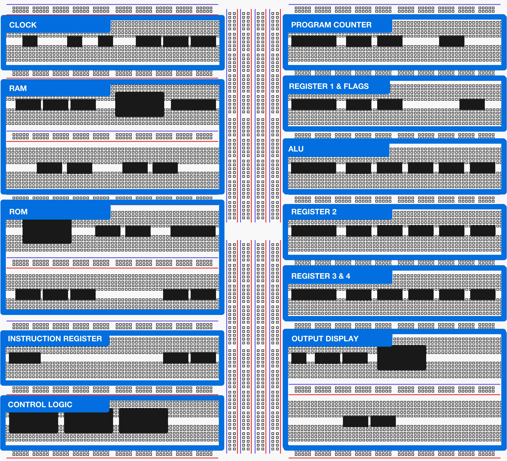
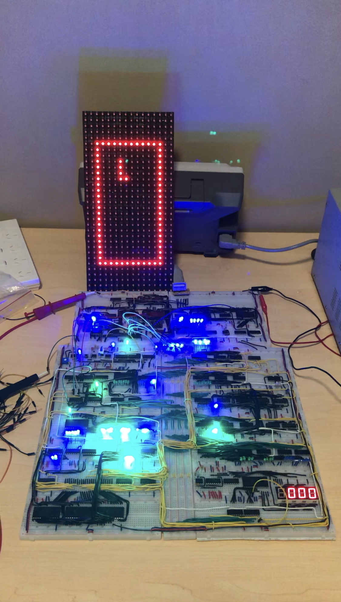

# BreadboardSimulator

This repo contains code to emulate an 8-Bit breadboard computer I built.  
The computer is based on a project published by [Ben Eater](https://github.com/beneater) (https://eater.net/8bit), however contains several additions including a DMD output display and 16-bit instructions.

  
   
  
